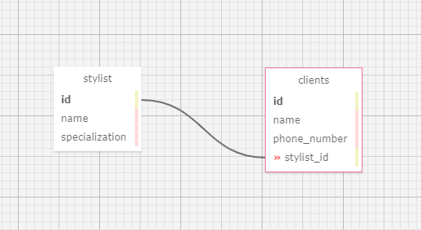

# **Hair Salon Stylist/ Client Tracker**
By _Olha Hizhytska_

## Description
An MVC web application designed as a One-to-Many Relationships program. It will help the user to manage their employees and corresponding clients to each employee. 

## User Stories

<details>
    <summary>Expand User Stories</summary>

- As the salon owner, I need to be able to see a list of all stylists.
- As the salon owner, I need to be able to select a stylist, see their details, and see a list of all clients that belong to that stylist.
- As the salon owner, I need to add new stylists to our system when they are hired.
- As the salon owner, I need to be able to add new clients to a specific stylist. I should not be able to add a client if no stylists have been added.

</details>

One-to-Many Relationships vizualization:



This application demonstrates:

- Creating and using Databases
- Using Entity Framework
- Using HTML Helper Methods
- Lazy Loading
- ViewBag
- Using MVC with Razor
- MVC Forms
- Practising HTTP CRUD methods
- RESTful routing
- Using SQL Designer

## Setup

#### To open this application:

- Clone this repository to your desktop, using next command:

  git clone https://github.com/OlgaHi/HairSalon.Solution.git

- Navigate to the top level of the directory.

  cd HairSalon.Solution

#### To run this application:

To run this application you need to install .NET 5. 
Please follow this steps:
 - Download [.NET 5 SDK (Software Development Kit)](https://https://dotnet.microsoft.com/download/dotnet/thank-you/sdk-5.0.100-macos-x64-installer). Clicking this link will prompt a file download for your particular OS from Microsoft.
 - Open the file. Follow the installation steps.
 - Confirm the installation is successful by opening your terminal and running the command $ dotnet --version. You should see something like this in response: 5.0.100. This means .NET was successfully installed.
 - Navigate to the /HairSalon folder 
 - Run the following command: dotnet build
 - Run the following command to execute this compiled code: dotnet run
 - In browser navigate to http://localhost:5000

## Re-create Database

This application contains Database file: olha_hizhytska.sql

Follow this instructions to re-create database:
- First, you need to install MySQL:

<details>
  <summary>Expand Installation</summary>

#### <span style="color:#c4f4ef">Mac</span> 
1. Download the MySQL Community Server .dmg file from the [MySQL Community Server page](https://dev.mysql.com/downloads/file/?id=484914). Click the download icon. Use the "No thanks, just start my download link."
2. Follow along with the Installer until you reach the Configuration page. Once you've reached Configuration, select or set the following options (use default if not specified):
    * Use Legacy Password Encryption.
    * Set password to "epicodus".
    * Click Finish.
    * Open the terminal and enter the command echo 'export PATH="/usr/local/mysql/bin:$PATH"' >> ~/.bash_profile. This will save this path in .bash_profile, which is where our terminal is configured.
    * Type in source ~/.bash_profile (or restart the terminal) in order to actually verify that MySQL was installed.
3. Verify MySQL installation by opening terminal and entering the command mysql -uroot -pepicodus. You'll know it's working and connected if you gain access and see the MySQL command line. If it's not working, you'll likely get a -bash: mysql: command not found error.
4. You can exit the mysql program by entering exit.
5. Download the MySQL Workbench .dmg file from the [MySQL Workbench page](https://dev.mysql.com/downloads/file/?id=484391). Use the "No thanks, just start my download link".
6. Install MySQL Workbench to Applications folder.
7. Open MySQL Workbench and select the Local instance 3306 server. You will need to enter the password "epicodus". If it connects, you're all set.

#### <span style="color:#c4f4ef">Windows</span> 
1. Download the MySQL Web Installer from the [MySQL Downloads page](https://dev.mysql.com/downloads/file/?id=484919). Use the "No thanks, just start my download link".
2. Follow along with the installer:
    * Click "Yes" if prompted to update.
    * Accept license terms.
    * Choose Custom setup type.
    * When prompted to Select Products and Features, choose the following:
        * MySQL Server 8.0.19 (This will be under "MySQL Servers > MySQL Server > MySQL Server 8.0")
        * MySQL Workbench 8.0.19 (This will be under "Applications > MySQL Workbench > MySQL Workbench 8.0")
    * Select "Next", then "Execute". Wait for download and installation. (This can take a few minutes.)
    * Advance through Configuration as follows:
        * High Availability set to "Standalone".
        * "Defaults are OK" under Type and Networking.
        * Authentication Method set to Use Legacy Authentication Method.
        * Set password to "epicodus". 
        * Defaults are OK under Windows Service. Make sure that checkboxes are checked for the options "Configure MySQL Server as a Windows Service" and "Start the MySQL Server at System Startup". Under Run Windows Service as..., the "Standard System Account" should be selected.
    * Complete Installation process.
3. Add the MySQL environment variable to the System PATH. You must include MySQL in the System Environment Path Variable. This is its own multi-step process:
    * Open the Control Panel and visit System and "Security > System". Select "Change Settings" and a pop-up window will display. Select the tab "Advanced" and select the "Environment Variables" button.
    * Within the System Variables navigator window, select PATH..., click Edit..., and then New.
    * Add the exact location of your MySQL installation, and click OK. (This location is likely C:\Program Files\MySQL\MySQL Server 8.0\bin, but may differ depending on your specific installation.)
4. Verify installation by opening Windows PowerShell and entering the command mysql -uroot -pepicodus. You'll know it's working and connected if you gain access and see MySQL's command line. You can exit the mysql program by entering exit.
5. Open MySQL Workbench and select the Local instance 3306 server (it may have a different name). You will need to enter the password "epicodus". If it connects, you're all set.

</details>

- To start using SQL:
  - Open terminal and run this command: ```mysql -u[UserName] -p[Password]```.
- To re-create database:
  - Run command:  ```SOURCE [FULL_PATH_TO_PROJECT]/olha_hizhytska.sql```

- Then, you need to create appsettings.json
 -  Create file ```appsettings.json``` in ```/HairSalon/```.
 -  Copy into appsettings.json, replacing username and password with your sql database details.
```
{
  "ConnectionStrings": {
      "DefaultConnection": "Server=localhost;Port=3306;database=olha_hizhytska;uid=[YourUserAccount];pwd=[YourPassword];"
  }
}
```
## Technologies Used:

* C#
* .NET 5
* ASP.NET Core MVC
* Entity
* SQL
* HTTP
* RESTful
* Razor
* HTML
* CSS
* Bootstrap

## Known Bugs

- No known issues

## License

[MIT](https://en.wikipedia.org/wiki/MIT_License)
Copyright (c) 2021 _Olha Hizhytska_

## Contact Information

- Olha Hizhytska olgainfotech@gmail.com

